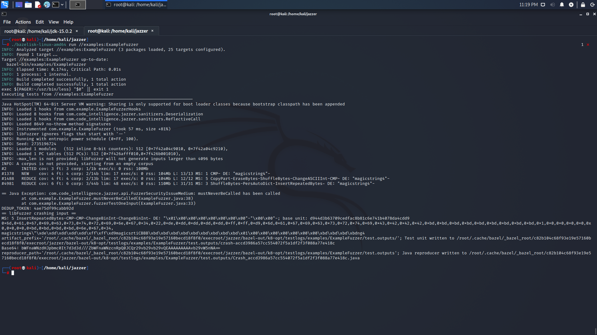
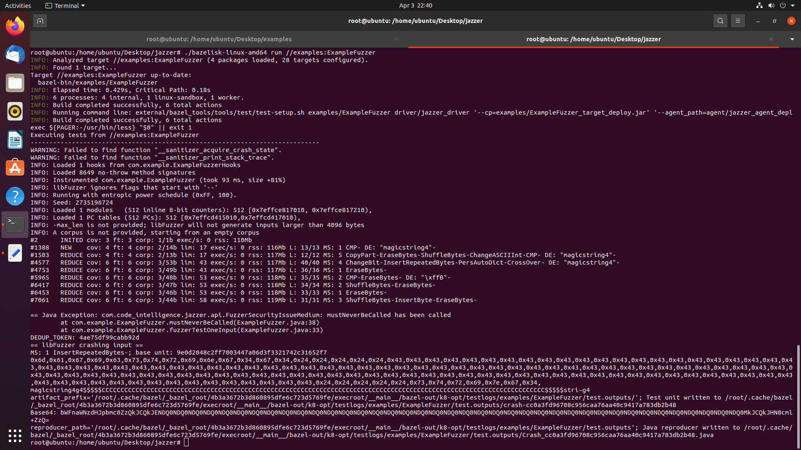
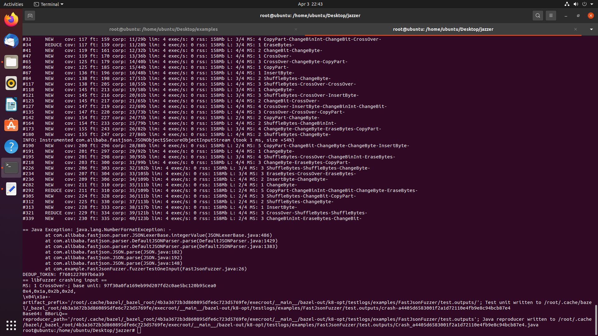

# Chapter 7 – Java Fuzzing

This chapter explores various techniques and tools for fuzzing Java applications, drawing from the examples provided in the directory structure.

## Introduction to Java Fuzzing

An overview of fuzzing in Java, its importance in ensuring robustness and security of Java applications, and the ecosystem of fuzzing tools available for Java.



## Java Fuzzing Tools and Frameworks

### 1. Jazzer
An in-depth look at Jazzer, a coverage-guided, in-process fuzzing engine for Java.

#### 1.1 Gson Fuzzing with Jazzer
Examining the Gson_fuzzing_with_jazzer directory to understand how to fuzz JSON parsing libraries.
- Setting up Jazzer for Gson fuzzing
- Writing effective fuzz targets for JSON parsing
- Identifying and addressing potential vulnerabilities in Gson

#### 1.2 Generex Fuzzing with Jazzer
Exploring the Generex_fuzzing_with_jazzer directory to fuzz regular expression generators.
- Challenges in fuzzing regex-based libraries
- Crafting inputs to stress test Generex
- Uncovering edge cases and potential issues in regex generation

#### 1.3 JSoup Fuzzing with Jazzer
Analyzing the JSoup_fuzzing_with_jazzer directory to fuzz HTML parsing.
- Designing fuzz targets for HTML/XML parsing libraries
- Identifying parsing vulnerabilities and inconsistencies
- Improving the robustness of JSoup through fuzzing

### 2. JavaFuzz
Exploring javafuzz, another fuzzing tool for Java applications.

#### 2.1 TIFF Fuzzing with JavaFuzz
Examining the Tiff_fuzzing_with_javafuzz directory to understand image format fuzzing.
- Setting up JavaFuzz for image processing libraries
- Generating valid and invalid TIFF inputs
- Comparing JavaFuzz results with other fuzzing tools

## Comparative Analysis and Advanced Techniques

### 3. JSON Fuzzing: Jazzer vs. Other Tools
Analyzing the Json_fuzzing_with_jazzer directory to compare Jazzer with other JSON fuzzing approaches.
- Effectiveness of different tools in finding JSON parsing bugs
- Performance comparisons and use case analyses
- Best practices for comprehensive JSON fuzzing in Java

### 4. TIFF Fuzzing: JavaFuzz vs. Jazzer
Comparing the results from Tiff_fuzzing_with_javafuzz and Tiff_fuzzing_with_jazzer.
- Strengths and weaknesses of each tool for image format fuzzing
- Combining multiple fuzzing tools for better coverage
- Strategies for fuzzing complex file formats in Java

## Best Practices and Guidelines

### 5. Writing Effective Java Fuzz Targets
Guidelines for creating fuzz targets that maximize code coverage and bug-finding potential in Java projects.
- Leveraging Java's type system for more effective fuzzing
- Strategies for fuzzing different types of Java methods and classes
- Common pitfalls in Java fuzz target implementation and how to avoid them

### 6. Integrating Fuzzing into Java Development Workflows
Strategies for making fuzzing a routine part of Java development and testing.
- When and how to write fuzz tests in Java projects
- Combining unit tests, property-based tests, and fuzz tests in Java
- Encouraging a fuzzing culture in Java development teams

### 7. Performance Optimization in Java Fuzzing
Techniques for improving the speed and effectiveness of Java fuzz testing.
- Profiling and optimizing Java fuzz targets
- Leveraging JVM optimizations for efficient fuzzing
- Parallel fuzzing strategies in Java

## Visual Demonstrations

### 8. Fuzzing in Action
Analysis of the provided demo images to illustrate key concepts and results.


- Explanation of what Demo_1.png demonstrates about Java fuzzing


- Insights gained from the visualization in Demo_2.png

## Conclusion

Summarizing key takeaways from Java fuzzing techniques, tools, and best practices. Discussion on the future of Java fuzzing and its role in ensuring robust and secure Java applications.

## Additional Resources

Referring to the README.md file for further reading, tutorials, and community resources related to Java fuzzing.


## Install Jazzer
``` sh
# clone the fuzzer project
git clone --depth 1 --recursive https://github.com/CodeIntelligenceTesting/jazzer

# install jazzer
cd jazzer
bazel run //:jazzer

# help for install
# https://github.com/CodeIntelligenceTesting/jazzer#installation
```

## Choose your target (jsoup)

target: jsoup: Java HTML Parser
github: https://github.com/jhy/jsoup
maven: https://mvnrepository.com/artifact/org.jsoup/jsoup

## Create your fuzz target

jsoup code example: https://github.com/jhy/jsoup/blob/master/src/test/java/org/jsoup/parser/HtmlParserTest.java

jazzer target example: https://github.com/CodeIntelligenceTesting/jazzer/blob/main/examples/src/main/java/com/example/FastJsonFuzzer.java

``` java

package com.example;

import org.jsoup.Jsoup;
import com.code_intelligence.jazzer.api.FuzzedDataProvider;

public class JSoupFuzzer {
  public static void fuzzerTestOneInput(FuzzedDataProvider data) {
    try {
      Jsoup.parse(data.consumeRemainingAsString());
    } catch (IllegalArgumentException ignored) {
    }
  }
}
```

## Modify maven/bazel configs

### Slow method

Add `"org.jsoup:jsoup:1.13.1"` inside `maven.bzl`:
``` sh
diff --git a/maven.bzl b/maven.bzl
index 621faac..460dc39 100644
--- a/maven.bzl
+++ b/maven.bzl
@@ -28,4 +28,5 @@ MAVEN_ARTIFACTS = [
     "com.fasterxml.jackson.dataformat:jackson-dataformat-cbor:2.12.1",
     "com.alibaba:fastjson:1.2.75",
     "com.beust:klaxon:5.5",
+    "org.jsoup:jsoup:1.13.1",
 ]

```

Add the following to `examples/BUILD.bazel`:
``` sh
java_fuzz_target_test(
    name = "JSoupFuzzer",
    srcs = [
        "src/main/java/com/example/JSoupFuzzer.java",
    ],
    target_class = "com.example.JSoupFuzzer",
    deps = [
        "@maven//:org_jsoup_jsoup",
    ],
)
```

### Fast method

Copy the files I'm providing using this command:
``` sh
cd jazzer
cp ../maven.bzl .
cp ../BUILD.bazel examples/BUILD.bazel
cp ../JSoupFuzzer.java examples/src/main/java/com/example/
```

## Run the fuzzer

``` sh
# rebuild maven cache
REPIN=1 bazel run @unpinned_maven//:pin

# run the fuzzer for jsoup
./bazelisk-linux-amd64 run //examples:JSoupFuzzer

# create a corpora folder
mkdir input_jsoup

# Launch the fuzzer with the corpora
./bazelisk-linux-amd64 run //examples:JSoupFuzzer -- /home/user/jazzer/input_jsoup
```

## java.lang.IllegalArgumentException 

``` sh
== Java Exception: java.lang.IllegalArgumentException: String must not be empty
  at org.jsoup.helper.Validate.notEmpty(Validate.java:92)
  at org.jsoup.nodes.Node.absUrl(Node.java:180)
  at org.jsoup.nodes.Node.attr(Node.java:72)
  at org.jsoup.nodes.Node.absUrl(Node.java:185)
  at org.jsoup.nodes.Node.hasAttr(Node.java:105)
  at org.jsoup.parser.HtmlTreeBuilderState$7.inBodyStartTag(HtmlTreeBuilderState.java:357)
  at org.jsoup.parser.HtmlTreeBuilderState$7.process(HtmlTreeBuilderState.java:282)
  at org.jsoup.parser.HtmlTreeBuilder.process(HtmlTreeBuilder.java:136)
  at org.jsoup.parser.TreeBuilder.runParser(TreeBuilder.java:66)
  at org.jsoup.parser.TreeBuilder.parse(TreeBuilder.java:47)
  at org.jsoup.parser.Parser.parse(Parser.java:107)
  at org.jsoup.Jsoup.parse(Jsoup.java:58)
  at com.example.JSoupFuzzer.fuzzerTestOneInput(JSoupFuzzer.java:14)
DEDUP_TOKEN: 39fdca2dbdec18ac
== libFuzzer crashing input ==
MS: 2 ShuffleBytes-CMP- DE: "abs:"-; base unit: 5a76a6c6b4be62f44682b7721fab8b543aa749d3
0x3c,0x1f,0x3c,0x62,0x6f,0x64,0x79,0x9,0x11,0x0,0x0,0xc,0xd,0x0,0x19,0x79,0x9,0x61,0x62,0x73,0x3a,0x0,0x0,0x0,0xc,0x41,0xf4,0xbe,0xc3,0x8f,0xff,0xc8,0x79,0x9,0x61,0x62,0x73,0x3a,0xc,0x41,0x3c,0x70,0xc,0xd,0x0,0x41,0x79,0x9,0x61,0x41,0x79,0x9,0x11,0x0,0x0,0xc,0xd,0x0,0x41,0x79,0x9,0x61,0x62,0x73,0x3a,0x0,0x0,0x0,0xc,0x41,0xf4,0xbe,0xc3,0x8f,0xf3,0xf2,0xff,0xc8,0x79,0x9,0x61,0x62,0x73,0x3a,0x61,0x62,0x73,0x3a,0xc,0x41,0x3c,0x70,0xc,0x1f,0x3c,0xd,0x0,0xf2,0xff,0xc8,0x79,0x9,0x61,0x62,0x73,0x2a,0x9,0x61,0x62,0x73,0x3a,0x2f,0x3c,
<\x1f<body\x09\x11\x00\x00\x0c\x0d\x00\x19y\x09abs:\x00\x00\x00\x0cA\xf4\xbe\xc3\x8f\xff\xc8y\x09abs:\x0cA<p\x0c\x0d\x00Ay\x09aAy\x09\x11\x00\x00\x0c\x0d\x00Ay\x09abs:\x00\x00\x00\x0cA\xf4\xbe\xc3\x8f\xf3\xf2\xff\xc8y\x09abs:abs:\x0cA<p\x0c\x1f<\x0d\x00\xf2\xff\xc8y\x09abs*\x09abs:/<
```

## java.lang.NullPointerException

``` sh
== Java Exception: java.lang.NullPointerException
  at org.jsoup.parser.HtmlTreeBuilderState$9.process(HtmlTreeBuilderState.java:934)
  at org.jsoup.parser.HtmlTreeBuilder.process(HtmlTreeBuilder.java:136)
  at org.jsoup.parser.TreeBuilder.runParser(TreeBuilder.java:66)
  at org.jsoup.parser.TreeBuilder.parse(TreeBuilder.java:47)
  at org.jsoup.parser.Parser.parse(Parser.java:107)
  at org.jsoup.Jsoup.parse(Jsoup.java:58)
  at com.example.JSoupFuzzer.fuzzerTestOneInput(JSoupFuzzer.java:14)
DEDUP_TOKEN: 9e9179ac336f418f
== libFuzzer crashing input ==
MS: 1 CrossOver-; base unit: 3a83a71f96b11e0b444cf18410e33a8f508156a5

```
